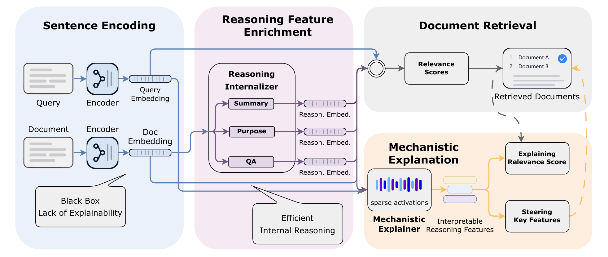

# Xetrieval: Mechanistically Explaining Dense Retrieval

Xetrieval is an embedding-level framework for mechanistically explaining dense
retrieval decisions. It combines a lightweight **reasoning internalizer** with a
TopK-SAE **mechanistic explainer**. For each query-document pair, Xetrieval
decomposes the query embedding and multiple document-side views into sparse,
human-interpretable features, then returns the shared active features `O(q,d)`
that connect the query and document in the mechanistic feature space.

<p align="center">
  
</p>

## Updates

- **[Released]** Inference code for feature-level retrieval explanation.
- **[Released]** TopK-SAE mechanistic explainer checkpoint.
- **[Released]** Reasoning internalizer checkpoints for `qa`, `summary`, and
  `purpose` document-side views.
- **[To do]** Release the feature hypothesis table used to map feature ids to
  natural-language explanations.

## Method Overview

Given a query `q` and document `d`, Xetrieval:

1. Encodes `q` and `d` with an e5-style embedding model.
2. Applies three reasoning internalizers to the document embedding `z_d`,
   producing `qa`, `summary`, and `purpose` document-side views.
3. Applies the TopK-SAE mechanistic explainer to the query embedding and all
   document-side views.
4. Computes shared active features between the query and each document view.
5. Aggregates those shared features across views and optionally attaches
   natural-language feature hypotheses.

The returned `shared_features` field corresponds to `O(q,d)` in the paper.

## Installation

```bash
git clone https://github.com/Hihiczx/Xetrieval.git
cd xetrieval
pip install -r requirements.txt
```

The default embedding model is [`intfloat/e5-large-v2`](https://huggingface.co/intfloat/e5-large-v2),
loaded through `sentence-transformers`.

## Checkpoints

This release includes:

```text
checkpoints/
  sae_model.pt
  reasoning_internalizer/
    model_qa.pt
    model_summary.pt
    model_purpose.pt
```

If you use custom checkpoints, pass their paths through the CLI:

- `--mechanistic_explainer_checkpoint`: TopK-SAE checkpoint.
- `--reasoning_internalizer_dir`: directory containing `model_qa.pt`,
  `model_summary.pt`, and `model_purpose.pt`.
- `--feature_hypotheses_path`: optional text file where line `i` is the
  natural-language hypothesis for feature `i`.

## Input Format

Input is JSONL, with one query-document pair per line:

```json
{"query_id": "q1", "doc_id": "d1", "query": "why does ice float?", "doc": "Water expands as it freezes, lowering the density of ice."}
```

`query` and `doc` are required. `query_id` and `doc_id` are optional.

## Usage

Run Xetrieval with the released checkpoints:

```bash
python explain_retrieval.py \
  --input_jsonl examples/query_doc_pairs.jsonl \
  --output_jsonl outputs/explanations.jsonl \
  --embedding_model_name intfloat/e5-large-v2 \
  --reasoning_internalizer_dir checkpoints/reasoning_internalizer \
  --mechanistic_explainer_checkpoint checkpoints/sae_model.pt \
  --device cuda \
  --batch_size 64
```

When `--feature_hypotheses_path` is omitted, the output contains feature ids
only. After the hypothesis table is released, add:

```bash
--feature_hypotheses_path path/to/feature_hypotheses.txt
```

## Output Format

Each output line is a JSON object:

```json
{
  "query_id": "q1",
  "doc_id": "d1",
  "shared_features": [12, 98],
  "per_view_shared_features": {
    "original": [12],
    "qa": [98],
    "summary": [],
    "purpose": [12]
  },
  "feature_explanations": [
    {"feature_id": 12, "hypothesis": "density and phase-change reasoning"},
    {"feature_id": 98, "hypothesis": "water-related physical explanation"}
  ]
}
```

`shared_features` is the union of the four `per_view_shared_features` sets.
